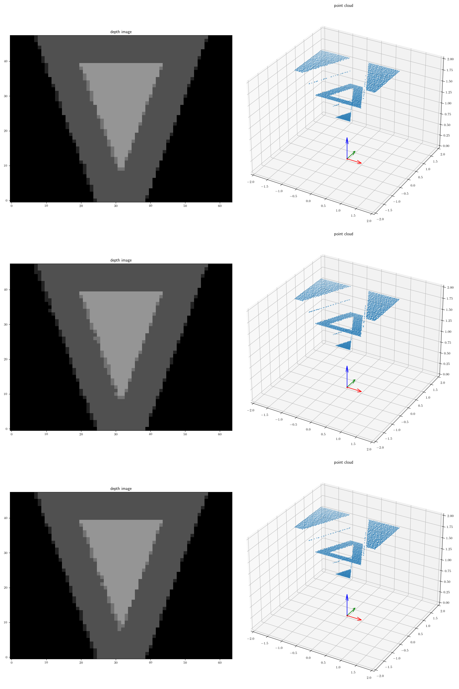

# GenRedner.jl
Gen.jl wrapper for the [Redner differentiable renderer](https://github.com/BachiLi/redner)


## Depth rendering generative function

The GenRedner module currently exports a one function:
```julia
depth_renderer = GenRedner.get_depth_renderer(num_samples)
```
where `num_samples` is the number of samples that the renderer will user internally for rendering and for its internal gradient estimation.
The returned value is a [generative function](https://www.gen.dev/dev/ref/gfi/#Generative-Functions-1) of concrete type `GenPyTorch.TorchGenerativeFunction`.

The returned generative function has the following type signature:

Arguments:

- `vertices` is a `n` x 3 matrix of floating point values, where `n` is the number of vertices in the mesh. Each row gives the x, y, and z coordinates of a mesh vertex in the camera's 3D coordinate frame (see below for this frame).

- `indices` is a `n` x 3 matrix of integers, where `n` is the number of triangle faces in the mesh. Each row gives the indices of the three vertices that comprise the face. The indices of vertices face start from 1.

- `instrinsics` is a length-4 vector of floating point values of the form `[fx, fy, cx, cy]` where `fx` is the horizontal focal length of the camera model, `fy` is the vertical focal length, and `cx` and `cy` give the principle points.

- `dims` is a length-2 vector of integers of the form `[width, height]` where `width` is the number of rows in the resulting depth image and `height` is the number of columns.

The return value is a 3D array of floating point values `points` with dimension `height ` x `width` x 3, where `points[:,:,1]` contains the x-coordinates in the camera's 3D coordinate frame, `points[:,:,2]` contains the y-coordinates, and `points[:,:,3]` contains the z-coordinates (i.e. the depth image). The first row of the matrix has the highest y-coordinate (corresponding to the bottom row of pixels in the image).

## Forward rendering and gradients

Like all generative functions, the returned depth rendering generative function supports both forward execution (via `Gen.simulate`) and computing gradients with respect to `vertices` and `intrinsics` (via `Gen.choice_gradients` or `Gen.accumulate_param_gradients!`). Note that this generative function has no trainable parameters of its own. The generative function is intended to be called from within a generative model of depth images. The generative funciton internally calls Redner for both forward rendering and for gradient computation.

## Coordinate frame

The input vertices and the output point cloud both are in the camera's 3D coordinate frame.
This coordinate frame is the same as the [3D camera coordinate frame used by OpenCV](https://docs.opencv.org/master/d9/d0c/group__calib3d.html#details) (the black coorinate frame in the image below):


## Installation

1. Add this package to your Julia environment (e.g. using `add https://github.com/probcomp/GenRedner.jl` from the Julia package manager).

2. Create a Python environment (e.g. using `virtualenv`) that has the `torch` Python package installed, and either `redner-gpu` or `redner` Python packages installed  (see [Redner](https://github.com/BachiLi/redner) for more details about setting up the Python environment).

3. Build the `PyCall` package so that it points to the Python environment you created. See the [GenPyTorch documentation](https://probcomp.github.io/GenPyTorch.jl/dev/#Installation-1) and the [PyCall documentation](https://github.com/JuliaPy/PyCall.jl#specifying-the-python-version) for more details.

## Example

See `example.jl` for a script that sets up an example scene consisting of a background square and two foreground triangles, and renders the point cloud using Redner, and also fits the vertices of the scene to the observed point cloud using stochastic gradient descent, using a from 

The Redner renderer computes the depth of a pixel by averaging the depth of continuous points inside the pixel.
For pixels on edges of sillhouettes, the depth values are therefore averages of the foreground and background depths.
Also, the Redner renderer is stochastic.
For depth images, it estimates the depth value for a pixel by sampling points inside the pixel.
Below are three depth images (left) produced by running the depth renderer on the same scene three times, and the point clouds produced by the renderer, with `num_samples=2`.
The camera coordinate frame is shown (red is X axis, green is Y axis, and blue is Z axis):



Note that when `num_samples=1`, there are no intermediate depth values. Each pixel is either the foreground or background planes:

Below is an animation of stochastic gradient ascent for MAP estimation:


## Other outputs

The Redner differentiable renderer produces many more output channels, including various types of RGB rendering (including photorealistic rendering), and object masks.
This wrapper will be extended with additional generative functions that wrap these other rendering capabilities in the future.
